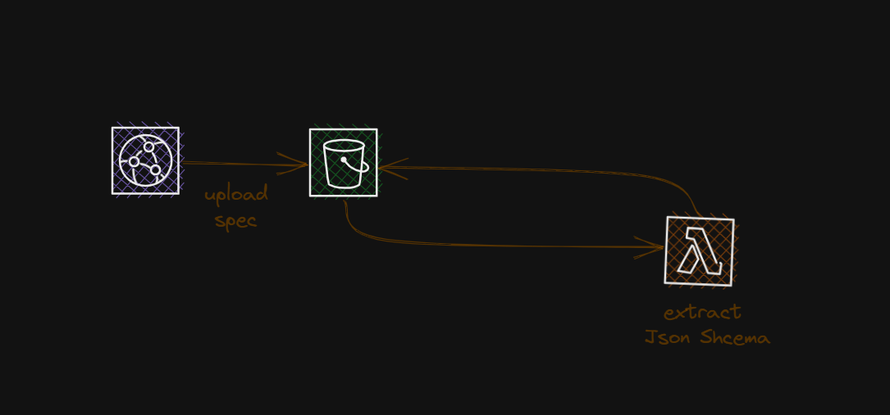

# AWS Event Core 

This Project is designed to centralize the events standardization and governance.

## The Design

### Registry

The Registery or Directory is a simple design to help centralize and governe all steaming Specifications at enterprise level

### Discovery

The Event discovery will be used to discover the events at runtime, collect them, Verify Compatibality
